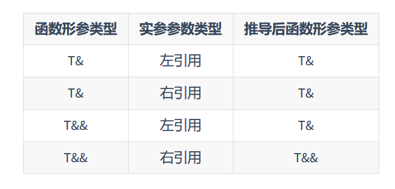

## 语言运行期的强化

### Lambda表达式

Lambda表达式是现代C++中最重要的特性之一，Lambda表达式，实际上就是提供了一个类似匿名函数的特性， 而匿名函数则是在需要一个函数，但是又不想费力去命名一个函数的情况下去使用的。

#### 基础

Lambda表达式的基础语法如下：

```c++
[捕获列表](参数列表) mutable(可选) 异常属性 -> 返回类型 {
// 函数体
}
```

捕获列表起到一个传递参数的作用，默认情况下函数体内部不能使用函数体外部的变量，这时就可以通过捕获列表来传递外部变量。

捕获列表可分为以下几种：

**值捕获**

与参数传值类似，值捕获的前提是变量可以拷贝（如果一个类的拷贝构造函数被删除（使用= delete标记）或者未定义，那么这个类的对象就不能被拷贝。例如，标准库中的std::unique_ptr就是不可拷贝的），不同之处则在于，被捕获的变量在 Lambda 表达式被创建时拷贝， 而非调用时才拷贝：

```c++
void lambda_value_capture() {
    int value = 1;
    auto copy_value = [value] {
        return value;
    };
    value = 100;
    auto stored_value = copy_value();
    std::cout << "stored_value = " << stored_value << std::endl;
    // 这时, stored_value == 1, 而 value == 100.
    // 因为 copy_value 在创建时就保存了一份 value 的拷贝
}
```

**引用捕获**

与引用传参类似，引用捕获保存的是引用，值会发生变化。

```c++
void lambda_reference_capture() {
    int value = 1;
    auto copy_value = [&value] {
        return value;
    };
    value = 100;
    auto stored_value = copy_value();
    std::cout << "stored_value = " << stored_value << std::endl;
    // 这时, stored_value == 100, value == 100.
    // 因为 copy_value 保存的是引用
}
```

**隐式捕获**

可以在捕获列表中写一个&或=向编译器声明采用引用捕获或者值捕获。捕获列表最常用的四种形式是：

- []空捕获列表
- [name1, name2]捕获一系列变量
- [&]引用捕获，让编译器自己推导捕获列表
- [=]值捕获，让编译器自己推导捕获列表

**表达式捕获**

C++14允许捕获的成员用任意的表达式进行初始化，这就允许了右值的捕获， 被声明的捕获变量类型会根据表达式进行判断。

#### 泛型Lambda

C++14开始，Lambda函数的形式参数可以使用auto关键字来产生意义上的泛型（auto不能写在普通函数的参数，会与模板的功能产生冲突）：

```c++
auto add = [](auto x, auto y) {
    return x+y;
};

add(1, 2);
add(1.1, 2.2);
```

### 函数对象包装器

#### std::function

Lambda表达式的本质是一个和函数对象类型相似的类类型（称为闭包类型）的对象（称为闭包对象）， 当Lambda表达式的捕获列表为空时，闭包对象还能够转换为函数指针值进行传递：

```c++
#include <iostream>

using foo = void(int); // 定义函数类型
void functional(foo f) { // 参数列表中定义的函数类型 foo 被视为退化后的函数指针类型 foo*
    f(1); // 通过函数指针调用函数
}

int main() {
    auto f = [](int value) {
        std::cout << value << std::endl;
    };
    functional(f); // 传递闭包对象，隐式转换为 foo* 类型的函数指针值
    f(1); // lambda 表达式调用
    return 0;
}
```

上面的代码给出了两种不同的调用形式，一种是将Lambda作为函数类型传递进行调用， 而另一种则是直接调用Lambda表达式，在C++11中，统一了这些概念，将能够被调用的对象的类型， 统一称之为可调用类型。而这种类型，便是通过std::function引入的。C++11中的std::function是一种通用、多态的函数封装， 它的实例可以对任何可以调用的目标实体进行存储、复制和调用操作， **它也是对C++中现有的可调用实体的一种类型安全的包裹（相对来说，函数指针的调用不是类型安全的）， 换句话说，就是函数的容器**。

通过函数指针调用函数在某些情况下被认为不安全，主要原因包括：

- 类型安全性：函数指针可能会指向任何类型的函数，如果函数签名（参数类型和返回类型）不匹配，编译器可能无法捕获这种错误。这可能导致运行时错误，如访问违规或未定义行为。

- 内存安全性：如果函数指针指向的函数已经从内存中卸载（例如，在动态链接库被卸载后），再次调用该指针将导致程序崩溃。

- 代码可读性和维护性：使用函数指针可能会使代码难以阅读和维护，特别是在指针被频繁传递和修改的情况下。

- 安全漏洞：恶意代码可能会尝试修改函数指针的值，以指向恶意函数，从而执行任意代码。这是常见的安全攻击之一，如缓冲区溢出攻击。

```c++
#include <functional>
#include <iostream>

int foo(int para) {
    return para;
}

int main() {
    // std::function 包装了一个返回值为 int, 参数为 int 的函数
    std::function<int(int)> func = foo;

    int important = 10;
    std::function<int(int)> func2 = [&](int value) -> int {
        return 1+value+important;
    };
    std::cout << func(10) << std::endl;
    std::cout << func2(10) << std::endl;
}
```

#### std::bind和std::placeholder

std::bind和std::placeholder可以将部分调用参数提前绑定到函数身上成为一个新的对象，然后在参数齐全后，完成调用。

```c++
int foo(int a, int b, int c) {
    ;
}
int main() {
    // 将参数1,2绑定到函数 foo 上，
    // 但使用 std::placeholders::_1 来对第一个参数进行占位
    auto bindFoo = std::bind(foo, std::placeholders::_1, 1,2);
    // 这时调用 bindFoo 时，只需要提供第一个参数即可
    bindFoo(1);
}
```

### 右值引用

浅拷贝和深拷贝：

**浅拷贝**

浅拷贝仅复制对象的顶层结构，不复制对象内部引用的其他对象。如果原对象和副本中的某个成员是指向同一个对象的指针，那么修改这个内部对象的状态会影响到原对象和副本。

```c++
#include <iostream>
#include <vector>

class ShallowCopyExample {
public:
    int* data;
    ShallowCopyExample(int d) {
        data = new int(d);
    }
    // 浅拷贝构造函数
    ShallowCopyExample(const ShallowCopyExample& other) {
        data = other.data;
    }
    ~ShallowCopyExample() {
        delete data;
    }
};
```

在这个例子中，复制ShallowCopyExample对象会导致新对象的data成员指向与原对象相同的内存地址。如果一个对象被销毁（调用析构函数），另一个对象的data指针就会悬挂，指向已释放的内存。

**深拷贝**

深拷贝不仅复制对象的顶层结构，还递归地复制对象内部引用的所有对象。这意味着原对象和副本是完全独立的；一个对象的修改不会影响另一个对象。

```
#include <iostream>
#include <vector>

class DeepCopyExample {
public:
    int* data;
    DeepCopyExample(int d) {
        data = new int(d);
    }
    // 深拷贝构造函数
    DeepCopyExample(const DeepCopyExample& other) {
        data = new int(*other.data);
    }
    ~DeepCopyExample() {
        delete data;
    }
};
```

在这个例子中，复制DeepCopyExample对象时，会创建一个新的int对象，并将其地址赋给新对象的data成员。这样，即使原对象被销毁，副本对象也不会受到影响，因为它们指向不同的内存地址。

总结：

- 浅拷贝：复制对象的顶层结构，不复制内部引用的对象。原对象和副本可能共享内部状态。

- 深拷贝：复制对象的顶层结构及其引用的所有对象，确保原对象和副本完全独立。

#### 左值、右值的纯右值、将亡值、右值

左值：表达式后仍然存在的持久对象

右值：表达式之后不再存在的临时对象
    - 纯右值：纯粹的右值，要么是纯粹的字面量，例如10, true； 要么是求值结果相当于字面量或匿名临时对象，例如1+2。非引用返回的临时变量、运算表达式产生的临时变量、 原始字面量、Lambda表达式都属于纯右值。
    - 将亡值：即将被销毁、却能够被移动的值。

将亡值：

```c++
std::vector<int> foo() {
std::vector<int> temp = {1, 2, 3, 4};
return temp;
}
std::vector<int> v = foo();
```

PS：教程中说这样会引起拷贝开销，尤其是当temp特别大的时候（是我没看完:(，作者最后提了）。而GPT说C++11引入的返回值优化（Return Value Optimization, RVO）以及后来的拷贝省略（Copy Elision，C++17）规则，不会引起额外的拷贝开销。

下面三个知识点可以看看[一文读懂C++右值引用和std::move-腾讯技术工程的文章](https://zhuanlan.zhihu.com/p/335994370)

#### 右值引用和左值引用

拿到一个将亡值，就需要用到右值引用：T &&，其中T是类型。 右值引用的声明让这个临时值的生命周期得以延长、只要变量还活着，那么将亡值将继续存活。C++11提供了std::move将左值参数转换为右值（实际上右值的本质也是通过move来实现）：

```c++
int &&ref_r = 5

// 等价于下面
int tmp = 5
int &&ref_r = std::move(tmp)

const int &b = std::move(1); // 合法, 常量左引用允许引用右值
```

需要注意的是ref_r虽然是右值引用，但是个左值。

#### 移动语义

传统的C++没有区分『移动』和『拷贝』的概念，造成了大量的数据拷贝，浪费时间和空间。 右值引用的出现恰好就解决了这两个概念的混淆问题：

```c++
#include <iostream>
class A {
public:
    int *pointer;
    A():pointer(new int(1)) {
        std::cout << "构造" << pointer << std::endl;
    }
    A(A& a):pointer(new int(*a.pointer)) {
        std::cout << "拷贝" << pointer << std::endl;
    } // 无意义的对象拷贝
    A(A&& a):pointer(a.pointer) {
        a.pointer = nullptr;
        std::cout << "移动" << pointer << std::endl;
    }
    ~A(){
        std::cout << "析构" << pointer << std::endl;
        delete pointer;
    }
};
// 防止编译器优化
A return_rvalue(bool test) {
    A a,b;
    if(test) return a; // 等价于 static_cast<A&&>(a);
    else return b;     // 等价于 static_cast<A&&>(b);
}
int main() {
    A obj = return_rvalue(false);
    std::cout << "obj:" << std::endl;
    std::cout << obj.pointer << std::endl;
    std::cout << *obj.pointer << std::endl;
    return 0;
}
```

a.pointer = nullptr;的目的是为了确保源对象a在资源被"移动"到新对象之后，不再拥有这块资源。这是必要的，因为当源对象a最终被销毁时，其析构函数会被调用，如果pointer没有被设置为nullptr，那么析构函数会尝试删除同一块内存两次（一次是在源对象a的析构函数中，另一次是在新对象的析构函数中），这会导致未定义行为，通常是程序崩溃。

标准库中移动语义的例子：

```c++
#include <iostream> // std::cout
#include <utility> // std::move
#include <vector> // std::vector
#include <string> // std::string

int main() {
    std::string str = "Hello world.";
    std::vector<std::string> v;

    // 将使用 push_back(const T&), 即产生拷贝行为
    v.push_back(str);
    // 将输出 "str: Hello world."
    std::cout << "str: " << str << std::endl;

    // 将使用 push_back(const T&&), 不会出现拷贝行为
    // 而整个字符串会被移动到 vector 中，所以有时候 std::move 会用来减少拷贝出现的开销
    // 这步操作后, str 中的值会变为空
    v.push_back(std::move(str));
    // 将输出 "str: "
    std::cout << "str: " << str << std::endl;

    return 0;
}
```

#### 完美转发

一个声明的右值引用其实是一个左值。这就为我们进行参数转发（传递）造成了问题：

```c++
void reference(int& v) {
    std::cout << "左值" << std::endl;
}
void reference(int&& v) {
    std::cout << "右值" << std::endl;
}
template <typename T>
void pass(T&& v) {
    std::cout << "普通传参:";
    reference(v); // 始终调用 reference(int&)
}
int main() {
    std::cout << "传递右值:" << std::endl;
    pass(1); // 1是右值, 但输出是左值

    std::cout << "传递左值:" << std::endl;
    int l = 1;
    pass(l); // l 是左值, 输出左值

    return 0;
}
```

无论模板参数是什么类型的引用，当且仅当实参类型为右引用时，模板参数才能被推导为右引用类型。这是因为引用塌缩的出现。



完美转发就是基于上述规律产生的。所谓完美转发，就是为了让我们在传递参数的时候， 保持原来的参数类型（左引用保持左引用，右引用保持右引用）。 为了解决这个问题，我们应该使用 std::forward 来进行参数的转发（传递）：

```c++
#include <iostream>
#include <utility>
void reference(int& v) {
    std::cout << "左值引用" << std::endl;
}
void reference(int&& v) {
    std::cout << "右值引用" << std::endl;
}
template <typename T>
void pass(T&& v) {
    std::cout << "              普通传参: ";
    reference(v);
    std::cout << "       std::move 传参: ";
    reference(std::move(v));
    std::cout << "    std::forward 传参: ";
    reference(std::forward<T>(v));
    std::cout << "static_cast<T&&> 传参: ";
    reference(static_cast<T&&>(v));
}
int main() {
    std::cout << "传递右值:" << std::endl;
    pass(1);

    std::cout << "传递左值:" << std::endl;
    int v = 1;
    pass(v);

    return 0;
}

/*
传递右值:
              普通传参: 左值引用
       std::move 传参: 右值引用
    std::forward 传参: 右值引用
static_cast<T&&> 传参: 右值引用
传递左值:
              普通传参: 左值引用
       std::move 传参: 右值引用
    std::forward 传参: 左值引用
static_cast<T&&> 传参: 左值引用
*/
```

**在使用循环语句的过程中，auto&&是最安全的方式:因为当auto被推导为不同的左右引用时，与&&的坍缩组合是完美转发。**